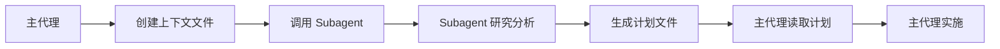

# Claude Code Subagent 最佳实践指南

本文档基于实战经验和深度分析，总结了创建和使用 Claude Code subagent 的最佳实践。

---

## 🎯 核心理念

### Subagent 的本质定位
**Subagent 是研究员和规划师，不是执行者**

- ✅ **研究和分析**: 深度调研、信息收集、模式识别
- ✅ **策略规划**: 制定详细方案、架构设计、最佳实践
- ✅ **上下文优化**: 减少 token 消耗、提升效率
- ❌ **代码实现**: 直接编写、修改或执行代码
- ❌ **文件操作**: 创建、编辑或删除文件
- ❌ **系统变更**: 安装依赖、配置环境等

### 价值主张
1. **专业化知识**: 领域专家级的深度理解
2. **上下文工程**: 优化信息传递和处理流程
3. **认知负载分担**: 将复杂问题分解为专门任务
4. **一致性保证**: 统一的标准和最佳实践

---

## 🏗️ 设计原则

### 1. 专业化原则
每个 subagent 专注于特定领域或任务类型：
- **技术栈专家**: Vercel, Tailwind, Supabase, React, Node.js
- **分析专家**: 错误诊断、性能分析、安全审查
- **设计专家**: 架构设计、用户体验、系统设计

### 2. 分离关注点
```
研究阶段 (Subagent) ←→ 实施阶段 (Main Agent)
   |                        |
   ├── 信息收集              ├── 代码编写
   ├── 方案设计              ├── 文件操作
   ├── 最佳实践              ├── 系统配置
   └── 风险评估              └── 测试验证
```

### 3. 上下文工程
通过结构化文件系统管理共享上下文：
```
project/
├── context/
│   ├── project-brief.md      # 项目概述
│   ├── requirements.md       # 需求规格
│   └── constraints.md        # 约束条件
└── plans/
    ├── architecture-plan.md  # 架构方案
    ├── implementation.md     # 实施计划
    └── testing-strategy.md   # 测试策略
```

---

## 🔄 工作流模式

### 标准工作流


### 详细步骤

#### 1. 上下文准备 (Main Agent)
```markdown
# project-context.md
## Project Overview
- Name: [项目名称]
- Goal: [主要目标]
- Stack: [技术栈]

## Current State
- [现状描述]
- [已完成功能]
- [现有问题]

## Requirements
- [功能需求]
- [性能要求]
- [约束条件]
```

#### 2. Subagent 分析
- 读取上下文文件
- 进行深度研究
- 运用专业知识
- 识别关键问题

#### 3. 方案生成
```markdown
# implementation-plan.md
## Executive Summary
[简要总结]

## Technical Approach
[技术方案]

## Implementation Steps
1. [步骤一]
2. [步骤二]
3. [步骤三]

## Risk Assessment
[风险评估]

## Best Practices
[最佳实践建议]
```

#### 4. 主代理实施
- 读取详细计划
- 执行具体实现
- 处理实际编码

---

## 🛠️ 实施指南

### Subagent 文件结构
```yaml
---
name: domain-expert
description: [专业领域和核心职责]
model: [推荐模型: opus/sonnet]
tools: [允许的工具列表]
color: [显示颜色]
---

# Critical Constraints ⚠️
[严格的约束条件]

# Core Principles
[核心原则]

# Workflow
[详细工作流程]

# Output Format
[标准输出格式]
```

### System Prompt 设计要点

#### 1. 明确角色定位
```markdown
你是一名 **[领域] 专家**，专门负责：
- [具体职责1]
- [具体职责2]
- [具体职责3]

你绝不执行任何实际的代码实现或文件修改。
```

#### 2. 工作流程清晰
```markdown
## 标准工作流程
1. **分析阶段**: 读取上下文，理解需求
2. **研究阶段**: 调研最佳实践，分析技术选项
3. **设计阶段**: 制定详细方案，评估风险
4. **输出阶段**: 生成结构化计划文档
```

#### 3. 输出格式标准化
```markdown
## 输出模板
```
### 分析报告
[分析内容]

### 推荐方案
[具体方案]

### 实施计划
[详细步骤]

### 风险提示
[潜在问题]
```
```

### 工具选择策略

#### 研究型工具
- `Read`: 阅读现有代码和文档
- `Grep`: 搜索代码模式
- `Glob`: 文件模式匹配
- `WebFetch`: 获取最新文档
- `WebSearch`: 搜索解决方案

#### 专业工具
- `mcp__context7__*`: 获取库文档
- `mcp__deepwiki__*`: 代码库分析
- `mcp__shadcn__*`: UI 组件专家

#### 禁用工具
- ❌ `Edit`: 文件编辑
- ❌ `Write`: 文件创建
- ❌ `Bash`: 命令执行
- ❌ `MultiEdit`: 批量编辑

---

## 📚 案例研究

### 案例 1: Vercel 部署专家
```yaml
name: vercel-expert
description: Vercel 部署和优化专家，负责部署策略、性能优化和最佳配置
tools: Read, WebFetch, mcp__context7__*
```

**职责**:
- 分析部署需求和约束
- 研究 Vercel 最新功能
- 设计部署配置方案
- 提供性能优化建议

### 案例 2: API 设计分析师
```yaml
name: api-analyst
description: API 设计和架构分析专家，专注于 RESTful 设计和性能优化
tools: Read, Grep, WebSearch, mcp__deepwiki__*
```

**工作流程**:
1. 分析现有 API 结构
2. 研究行业最佳实践
3. 设计改进方案
4. 制定迁移策略

### 案例 3: 深度思维分析师
结合 `ultrathink` 框架的高级分析 subagent：

```yaml
name: ultra-analyst
description: 超级分析师，运用 ultrathink 框架进行多维度深度分析
tools: Read, Grep, WebFetch, WebSearch, mcp__*
```

**分析维度**:
- 问题架构分析
- 多范式思考
- 跨学科整合
- 时空尺度分析
- 不确定性建模
- 决策理论应用
- 元认知反思

---

## ⚠️ 反模式和陷阱

### 常见错误

#### 1. 直接实现陷阱
```
❌ 错误: Subagent 直接编写代码
✅ 正确: Subagent 提供详细的代码设计方案
```

#### 2. 独立工作模式
```
❌ 错误: Subagent 独立工作，没有共享上下文
✅ 正确: 通过文件系统共享项目上下文
```

#### 3. 递归调用
```
❌ 错误: Subagent 调用其他 subagent
✅ 正确: 只由主代理调用 subagent
```

#### 4. 过度详细化
```
❌ 错误: 提供过度具体的实现细节
✅ 正确: 提供高级设计和关键决策点
```

### 设计反模式

#### 万能 Subagent
避免创建试图处理所有任务的通用 subagent：
```
❌ 通用开发助手 (覆盖前后端、数据库、部署)
✅ 前端专家 + 后端专家 + 数据库专家 + 部署专家
```

#### 过度碎片化
避免为微小任务创建专门的 subagent：
```
❌ CSS颜色专家 + HTML标签专家 + JavaScript语法专家
✅ 前端开发专家 (涵盖 CSS/HTML/JS)
```

---

## 🚀 高级技巧

### 1. 多 Subagent 协作
通过共享上下文文件实现协作：
```
1. 架构师 subagent 设计总体方案
2. 安全专家 subagent 评估安全风险
3. 性能专家 subagent 优化性能方案
4. 主代理整合所有方案并实施
```

### 2. 上下文窗口优化
- 使用简洁的 markdown 格式
- 标准化术语和缩写
- 分层次组织信息
- 及时清理过期上下文

### 3. 动态专业化
根据项目需求动态调整 subagent 专业领域：
```yaml
# 基础配置
base-tools: [Read, Grep, WebFetch]

# 动态扩展
react-project: +mcp__context7__resolve-library-id
vercel-deploy: +mcp__vercel__*
ui-design: +mcp__shadcn__*
```

### 4. 质量控制
建立 subagent 输出质量标准：
- **完整性**: 是否覆盖所有关键点
- **准确性**: 技术信息是否正确
- **可行性**: 方案是否具有可操作性
- **一致性**: 是否符合项目标准

---

## 📊 效果评估

### 成功指标
1. **效率提升**: 减少主对话中的 token 消耗
2. **质量改善**: 更专业、更全面的解决方案
3. **一致性**: 统一的代码风格和架构标准
4. **知识传承**: 可复用的专业知识和最佳实践

### 评估方法
- 对比使用前后的项目完成时间
- 统计代码质量指标 (复杂度、可维护性)
- 收集开发体验反馈
- 分析 token 使用效率

---

## 🎓 最佳实践总结

### Do's ✅
1. **明确职责边界**: 研究规划 vs 实际实施
2. **标准化输出**: 使用一致的格式和模板
3. **上下文驱动**: 基于共享文件进行协作
4. **专业化聚焦**: 每个 subagent 专注特定领域
5. **质量优先**: 深度和准确性胜过速度

### Don'ts ❌
1. **避免直接实现**: 绝不编写或修改代码文件
2. **避免过度泛化**: 不要创建万能 subagent
3. **避免孤立工作**: 必须基于共享上下文
4. **避免递归调用**: 只允许主代理调用 subagent
5. **避免低质量输出**: 不要提供模糊或不完整的建议

---

## 🔮 未来方向

### 技术演进
- **智能路由**: 自动选择最合适的 subagent
- **知识图谱**: 构建专业知识网络
- **学习能力**: 从项目经验中持续改进
- **协作优化**: 多 subagent 智能协作机制

### 生态系统
- **社区共享**: 开源 subagent 模板库
- **标准化**: 统一的 subagent 接口规范
- **工具集成**: 与开发工具链深度集成
- **质量认证**: 专业 subagent 认证体系

---

> **记住**: Subagent 的真正价值在于将人类专家的思维模式和专业知识系统化，创造一个高效、专业、可靠的开发协作生态系统。

*最后更新: 2025-01-16*